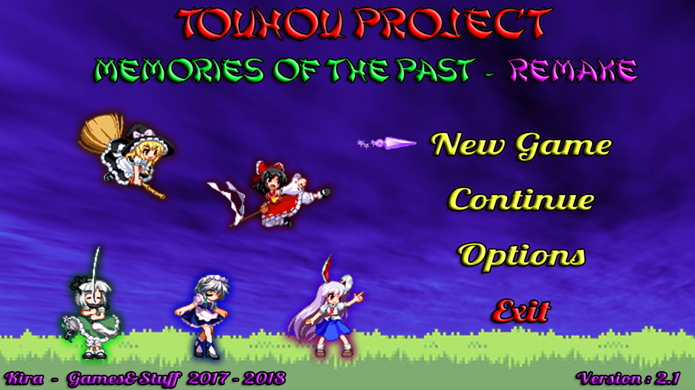
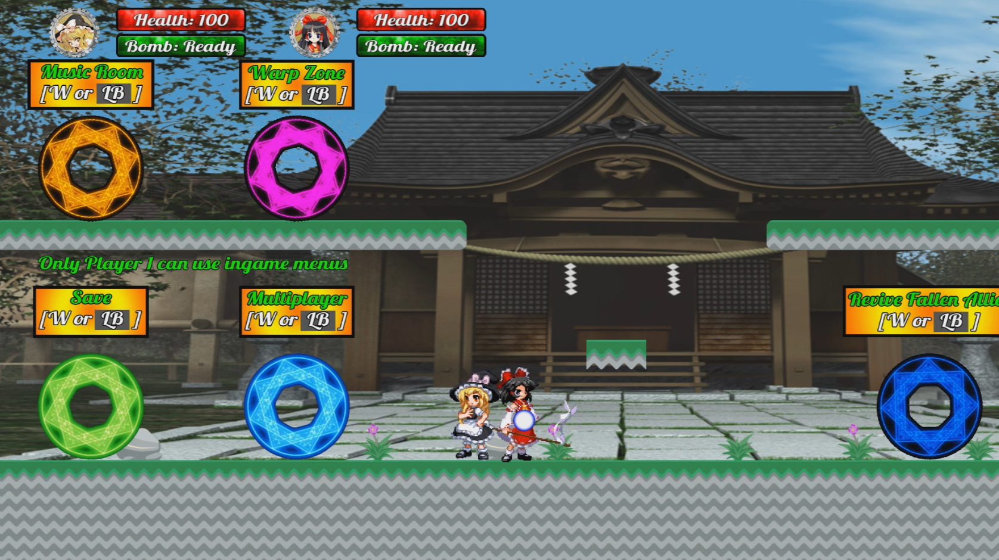
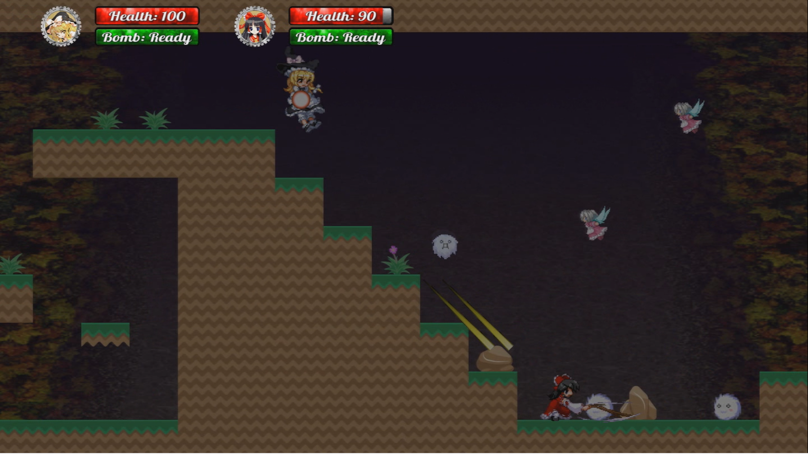
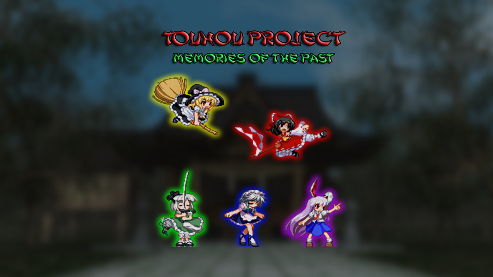

# Touhou Fangame - Memories Of The Past
Welcome everybody. This repository is to host a little Touhou fangame I made back in 2017. This game is completely free and I don't own anything from Touhou Project mark, all rights are reserved to ZUN and Team Shangai Alice.
- It's a local coop 2D platform game up to 2 players at the same time. 
- Someone sent a threatening letter to Reimu and she ask Marisa to help her searching the sender. 
- The game is divided in worlds with stages and a boss each one.
- You can only save at Hakurei's Shrine, make sure to pay a visit everytime you clear a world.
- If the player (or players in coop) dies, it respawns at Hakurei's Shrine.
- There are 5 playable characters but you start the game with only 2.
- Default controls for keyboard are arrow keys to move and crouch, Z to jump, X to attack, C to run, A to shoot, S for special, Q for show hitbox, W to interact, M for map and P to pause the game (you can change every key but move and crouch).
- Second player needs a controller to play, being the left joystick used to move and crouch, A to jump, X to attack, Y for special, B to shoot, Select for map, Right bumper for run, Left bumper to interact, L3 for show hitbox and Start to pause (on a Xbox controller).

Here's some screenshots of the game:

  

  

  

You can also watch a full coop gameplay if you want [part one here](https://youtu.be/_OlfO011vLM) and [final part here](https://youtu.be/CrIsaC3fA1I)

  

